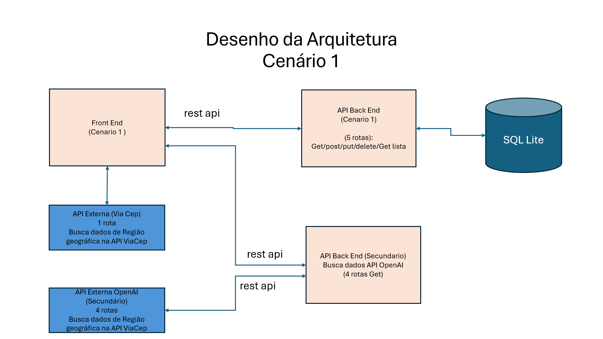

# Enriquece Metadados de Veículos via API acesso à APIExterna da Viacep e API da OpenAI
# API Back End - Responsável pelo armazenamento , recuperação das informações de Veículos na base de dados SqlLignt
# Data: 13/04/2025
# Por: Ronaldo Ramos da Costa.
Este pequeno projeto faz parte da entrega do MVP da Disciplina **Arquitetura de Software** 


## Arquitetura da Solução: 
[](/)


## Situação Problema


Diversos sistemas envolvendo o cadastramento de Metadados, muitas vezes são incompletos e possuem grande dificuldade para encontrar  informações relevantes que possam garantir a completude de uma gama de dados necessários para o bom funcionamento do negócio. A dificuldade de encontrar informações, pode ser apoiada com o uso de APIs e com o uso de Inteligência Artificial e por que não as duas conjulgadas, como é o caso.


##  Objetivo


Este experimento tem o objetivo não só utilizar API's externas de serviço (VIACEP), mas também utilizar a API da OpenAIi - Inteligência Artificial , para complementar informações cruzadas de Automóveis e Localização a partir do CEP , encontrando valores de venda praticados para o Carro não região, bem como o valor de custo de um seguro Anual do automóvel na região do Cep.

Além disso, uma outra busca na IA , coleta Características complementares da Localização do veículo, trazendo uma agregação robusta de informações que contribui e apoia o usuário.

Esta API de BACK-END, armazena todas as informações no  banco de dados SQL Lite, utilizado por esta API, disponibilizando para o front end o uso de 5 rotas: GET Automóveis - Lista de Automóveis, GET Automóvel - Recuperação de um único Automóvel, POST para inserção de Automóvel, e PUT para Atualização de um Automóvel.

As informações são recuperadas em grade e podem ser editadas, excluídas via Front End.

Desta forma conseguimos validar a eficiência do uso da APIS e da Inteligência Artificial para complementação e enriquecimento de metadados em sistemas de informação.

Este projeto é uma prova de conceito que apoiará em um obetivo maior que é enriquecer informações associadas ao Business de Petroleo e Gás paras sistemas com grande carência de informações cadastrais.  Este será um desdobramento natural deste experimento.

##  Escopo do MVP

O MVP contempla o cadastro e recuperação de  atributos vinculados a um automóvel, Regiao pesquisada via CEP e Resultado da Busca de informações complementares na API da OpenAI.


**Funcionalidades do Escopo do MVP**
O MVP permite cadastrar uma nova 'busca por modelo de automóvel', apresenta os modelos cadastrados,viabiliza pesquisa pelo nome do modelo e realiza exclusão/recuperação automóveis a partir do uso da grade que lista os automóveis cadastrados na base de dados. Uma API foi desenvolvida e sua documentação exposta via OPEN API SWAGGER, e um front end utiliza os respectivos métodos para realizar as respectivas operações.

Esta API de Back-End armazena informações de Automóveis, Região e Informações buscadas via API da Open AI.

---
## Como executar 

Será necessário ter todas as libs python listadas no `requirements.txt` instaladas.

Não é necessário utilizar nenhuma chave da Open API neste arquivo de BackEnd, pois ele somente ggerencia o armazenamento e recuperação de informações atendendo o Front-End. 


## ---Docker ----------------------------------------------------------------------------------------------------------
##
--
## Como executar através do Docker

Certifique-se de ter o [Docker](https://docs.docker.com/engine/installclear/) instalado e em execução em sua máquina.

Navegue até o diretório que contém o Dockerfile e o requirements.txt no terminal.
Execute **como administrador** o seguinte comando para construir a imagem Docker:

```
$ docker build -t rest-api .
```

Uma vez criada a imagem, para executar o container basta executar, **como administrador**, seguinte o comando:

```
$ docker run -p 5000:5000 rest-api
```

## Utilizando o BackEnd

Após a instalação, as rotas e endpoints são disponibilizados na OpenAPI/Swagger para utilização de acordo com a documentação disponível no site.

Uma vez executando, para acessar a API, basta abrir o [http://localhost:5000/#/](http://localhost:5000/#/) no navegador.


### Comandos úteis do Docker

>**Para verificar se a imagem foi criada** você pode executar o seguinte comando:
>
>```
>$ docker images
>```
>
> Caso queira **remover uma imagem**, basta executar o comando:
>```
>$ docker rmi <IMAGE ID>
>```
>Subistituindo o `IMAGE ID` pelo código da imagem
>
>**Para verificar se o container está em exceução** você pode executar o seguinte comando:
>
>```
>$ docker container ls --all
>```
>
> Caso queira **parar um conatiner**, basta executar o comando:
>```
>$ docker stop <CONTAINER ID>
>```
>Subistituindo o `CONTAINER ID` pelo ID do conatiner
>
>
> Caso queira **destruir um conatiner**, basta executar o comando:
>```
>$ docker rm <CONTAINER ID>
>```
>Para mais comandos, veja a [documentação do docker](https://docs.docker.com/engine/reference/run/).


